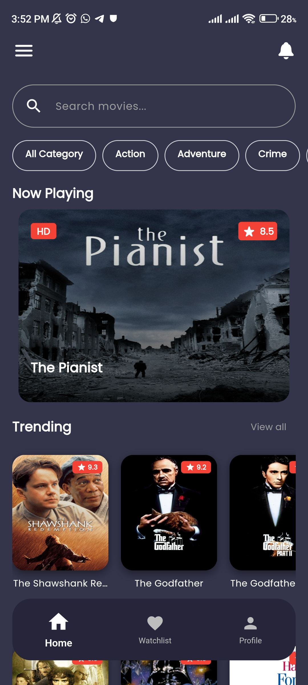
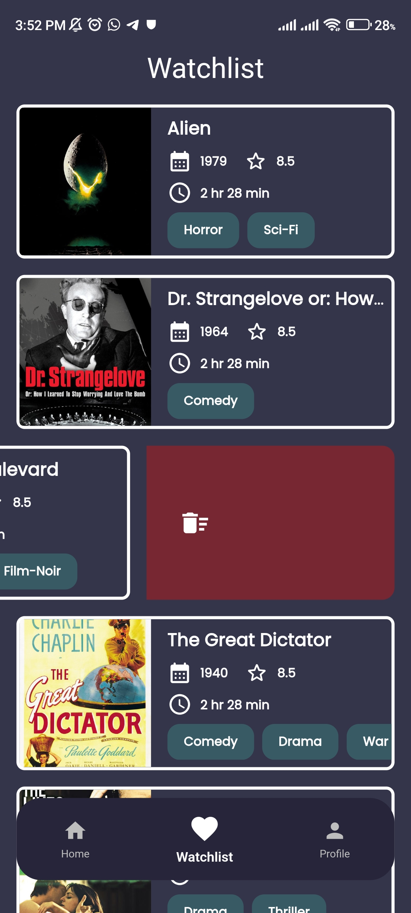
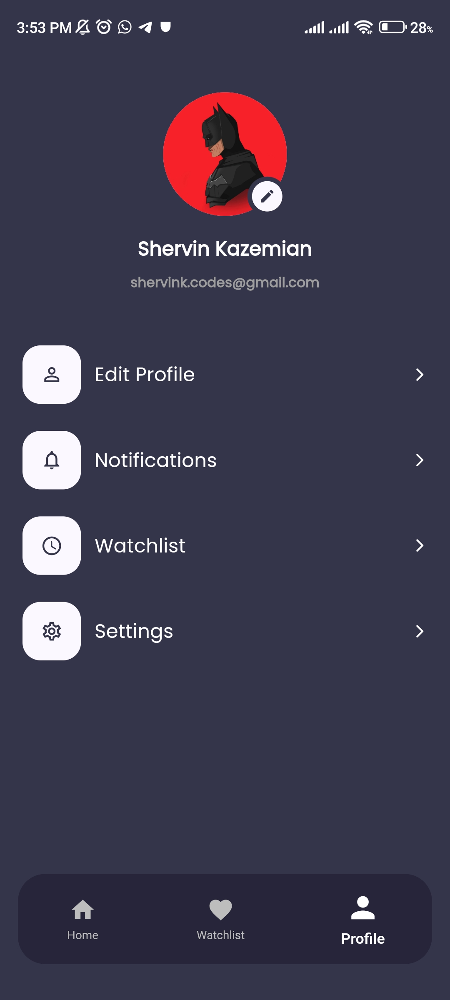

# 🎬 Plotify

**Movies at your fingertips.**

Plotify is a beautiful Flutter app that lets you discover, search, and explore movies and TV shows with a modern, intuitive interface. Built with clean architecture and best practices, Plotify is your gateway to the world of entertainment.

---

## 📸 Screenshots  
| Home Screen | Watchlist Screen | Profile Screen |
|------------|----------|----------|
|  |  |  |

---

## ✨ Features

- 🔍 **Search** for movies and shows instantly
- 🏠 **Home** with trending, new releases, and recommended lists
- 📄 **Detail Page** with rich information, genres, ratings, and more
- 🖼️ **Story Carousel** for now playing highlights
- 📑 **Categories** for easy browsing
- 🕵️ **Profile & Watchlist** management
- 🚀 **Splash Screen** for a smooth start
- 🎨 Beautiful custom themes and fonts
- 📱 Responsive design for all platforms

---

## 📂 Project Structure

```
lib/
  app.dart                # App entry point
  main.dart               # Main function
  core/                   # Core modules (constants, models, API, theme)
  features/               # Feature modules (home, detail, profile, splash, watchlist)
  routes/                 # App routing
assets/
  image/                  # App images
  icon/                   # App icons
```

---

## 🛠️ Tech Stack

- **Flutter** (SDK ^3.9.0)
- [Provider](https://pub.dev/packages/provider) for state management
- [Dio](https://pub.dev/packages/dio) for networking
- [Carousel Slider](https://pub.dev/packages/carousel_slider) for carousels
- [Animated Text Kit](https://pub.dev/packages/animated_text_kit) for animations
- [Google Fonts](https://pub.dev/packages/google_fonts) for typography
- [Photo View](https://pub.dev/packages/photo_view) for image zoom
- [Gap](https://pub.dev/packages/gap) for spacing

---

## 🚀 Getting Started

1. **Clone the repository**
   ```sh
   git clone https://github.com/ShervinKazemi/Plotify.git
   cd Plotify
   ```
2. **Install dependencies**
   ```sh
   flutter pub get
   ```
3. **Run the app**
   ```sh
   flutter run
   ```

---

## 📸 Screenshots

> _Add screenshots of your app here for a more visual README !_

---

## 📄 License

This project is for educational and personal use only. Not for commercial distribution.

---

## 💡 Credits

Made with ❤️ by ShervinKazemi and contributors.

---

## 🤝 Contributing

Pull requests are welcome! For major changes, please open an issue first to discuss what you would like to change.

---

## 📬 Contact

For questions or feedback, reach out via [GitHub Issues](https://github.com/ShervinKazemi/Plotify/issues).

---

Enjoy exploring movies with Plotify! 🎥
